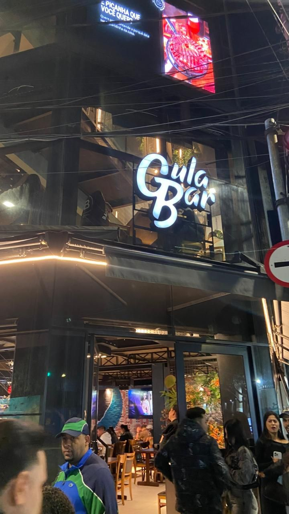
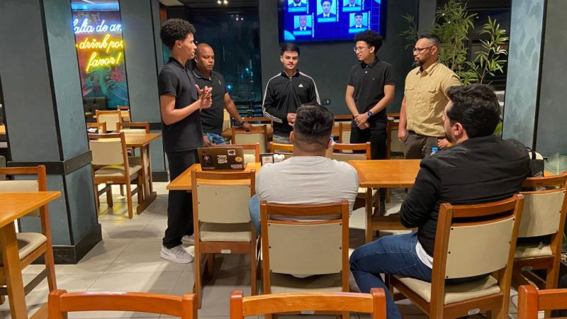
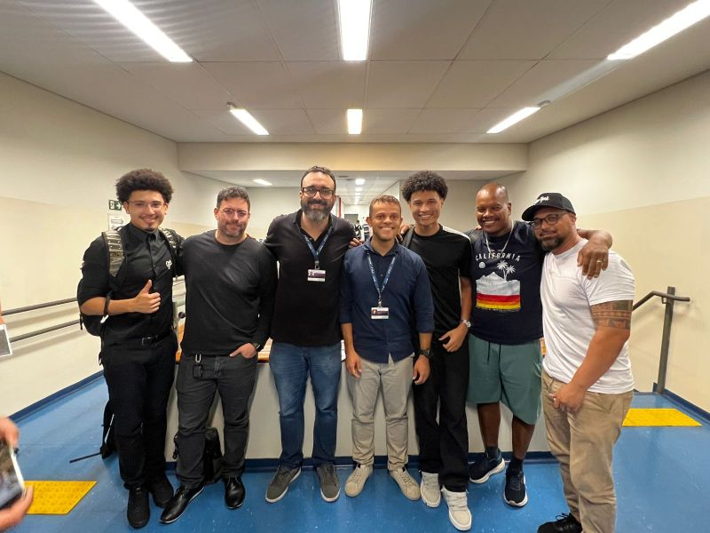

## 🟡 Gula Bar — Análise de Riscos

Projeto de análise de riscos conduzido com foco na identificação de ativos, vulnerabilidades, ameaças e possíveis impactos ao ambiente avaliado, considerando aspectos operacionais, tecnológicos e de segurança da informação.

### 🎯 Objetivo
Mapear os riscos relevantes do ambiente analisado, apoiar a priorização de vulnerabilidades e propor recomendações de mitigação para redução da superfície de risco.

### 📌 Escopo
- Levantamento de ativos e pontos críticos
- Identificação de vulnerabilidades e fragilidades
- Análise de ameaças prováveis
- Avaliação de impacto no negócio
- Priorização de riscos

### ⚙️ Metodologia
A análise foi conduzida com base na identificação de cenários de risco, avaliação de probabilidade e impacto, classificação de criticidade e definição de recomendações para tratamento dos riscos identificados.

### 🔍 Principais pontos avaliados
- Exposição de ativos e serviços
- Fragilidades em controles de segurança
- Riscos operacionais e tecnológicos
- Impactos em disponibilidade, integridade e confidencialidade
- Necessidade de mitigação e fortalecimento de controles

### 🛡️ Recomendações
- Reforço de controles de segurança
- Correção de vulnerabilidades priorizadas
- Redução de exposições desnecessárias
- Adoção de boas práticas de hardening
- Melhoria de monitoramento e resposta

### ✅ Resultado
O projeto permitiu consolidar uma visão estruturada dos riscos do ambiente avaliado, apoiar a tomada de decisão na priorização de ações corretivas e fortalecer a postura de segurança por meio de recomendações práticas de mitigação.

### 🔒 Observação
As informações sensíveis do ambiente avaliado foram preservadas, mantendo o foco na abordagem técnica e metodológica do projeto.

---

## 📸 Contexto do Projeto

As imagens abaixo representam o ambiente analisado e registros da apresentação do projeto realizada com a equipe e docentes.

  

  
  

  

