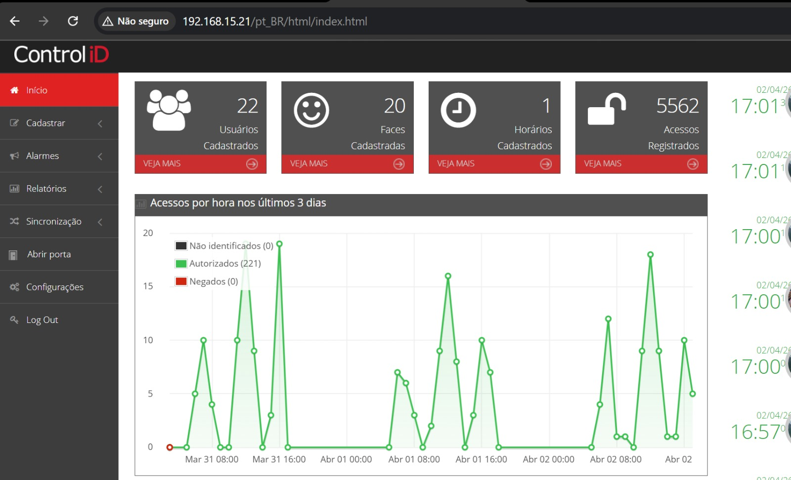
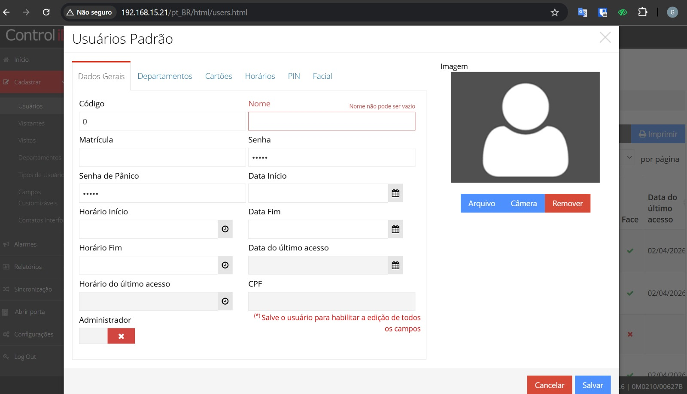
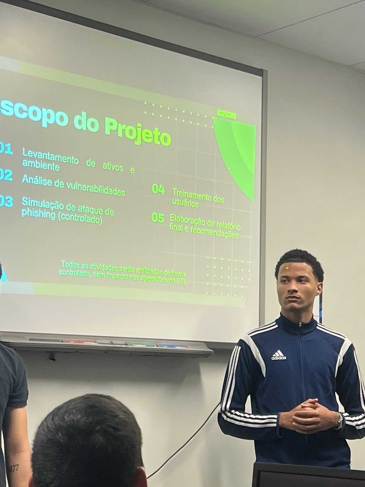
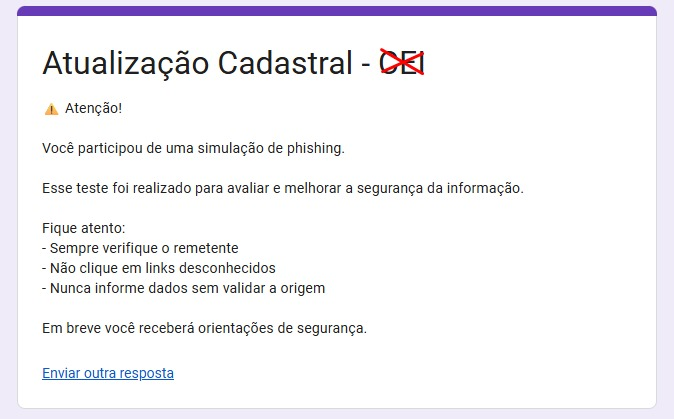

# 🔴 Pentest + Simulação de Phishing (Engenharia Social)

## 📂 Estrutura do Projeto

O projeto foi dividido em três frentes principais:

- 🔍 **Pentest** — análise técnica de vulnerabilidades e testes controlados
- 🎣 **Simulação de Phishing** — campanha de engenharia social
- 🧠 **Conscientização** — treinamento aplicado aos usuários

Cada etapa contém evidências e documentação própria.

Projeto prático de segurança conduzido em ambiente corporativo autorizado, com foco na realização de testes de intrusão controlados e simulação de ataque de engenharia social, visando identificar vulnerabilidades técnicas e comportamentais, além de apoiar ações de mitigação e conscientização em segurança.

---

## 🎯 Objetivo

Avaliar a postura de segurança do ambiente por meio de atividades controladas de pentest e simulação de phishing, identificando fragilidades técnicas, riscos relacionados ao fator humano e oportunidades de melhoria nos controles de segurança.

---

## 📌 Escopo

- Levantamento inicial do ambiente avaliado
- Identificação de superfícies de ataque
- Testes controlados de intrusão
- Simulação de campanha de phishing
- Coleta controlada de interações dos usuários
- Avaliação de riscos técnicos e comportamentais

---

## ⚙️ Metodologia

A abordagem foi conduzida de forma controlada e autorizada, combinando análise técnica do ambiente com simulação de engenharia social para avaliação prática da exposição a ameaças.

## 💻 Sistema analisado

---

## Etapas executadas

1. Reconhecimento inicial e entendimento do ambiente
2. Identificação de possíveis fragilidades técnicas
3. Execução de testes controlados de intrusão
4. Planejamento da campanha de phishing
5. Criação e envio de conteúdo simulado
6. Monitoramento das interações
7. Consolidação dos resultados e recomendações

## 📊 Planejamento do projeto

---

## 🔍 Técnicas utilizadas

- Pentest em ambiente autorizado
- Phishing simulation
- Engenharia social
- Análise comportamental
- Identificação de vulnerabilidades
- Avaliação de risco

---

## 📊 Principais pontos avaliados

- Exposição de ativos e superfícies de ataque
- Fragilidades técnicas identificadas no ambiente
- Taxa de interação com conteúdo simulado
- Possível exposição de credenciais em cenário controlado
- Nível de conscientização dos usuários
- Impacto potencial de exploração

---

## ⚠️ Riscos identificados

- Fragilidades técnicas exploráveis
- Baixa conscientização de usuários
- Possível comprometimento de credenciais
- Exposição a ataques de engenharia social
- Necessidade de reforço em controles de segurança

## 🛡️ Conscientização pós-simulação

Após a interação do usuário com o conteúdo simulado, foi apresentada uma mensagem educativa com orientações de segurança, reforçando boas práticas e conscientização sobre ataques de phishing.

---

## 🛡️ Recomendações

- Correção das vulnerabilidades priorizadas
- Reforço de controles de segurança
- Implementação ou fortalecimento de MFA
- Treinamentos de conscientização
- Simulações periódicas de phishing
- Melhoria de monitoramento e resposta

---

## 📈 Resultado

O projeto permitiu identificar riscos técnicos e comportamentais relevantes, apoiar a priorização de correções e fortalecer a postura de segurança por meio de recomendações práticas, tanto no aspecto defensivo quanto na conscientização de usuários.

---

## 🧩 Skills aplicadas

- Pentest em ambiente controlado
- Análise de vulnerabilidades
- Engenharia social
- Conscientização de usuários
- Avaliação de risco
- Documentação técnica
- Pensamento defensivo e ofensivo em segurança

## 👥 Execução do projeto

---

## 🔒 Observação

Este projeto foi realizado em ambiente autorizado e controlado, sem exposição de dados sensíveis, mantendo o foco na abordagem técnica, metodológica e educacional do case.
